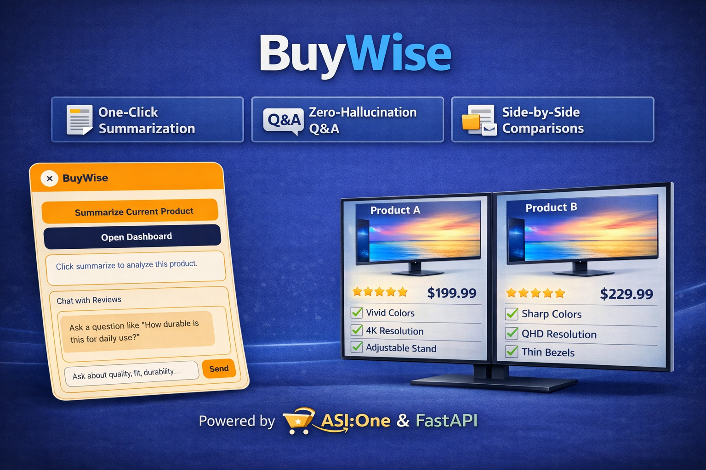
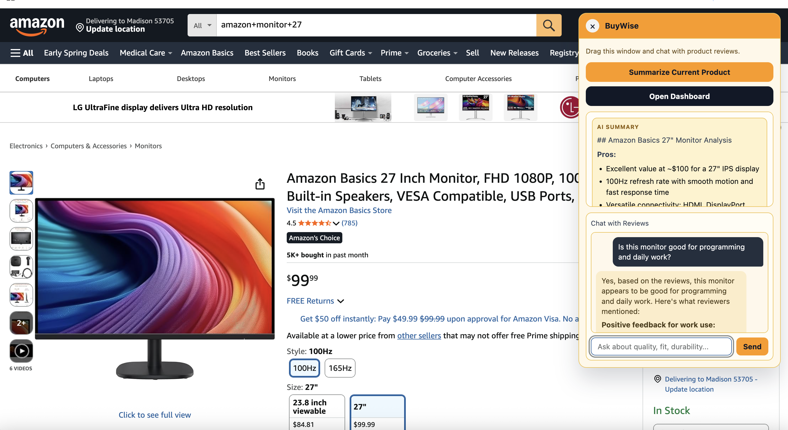
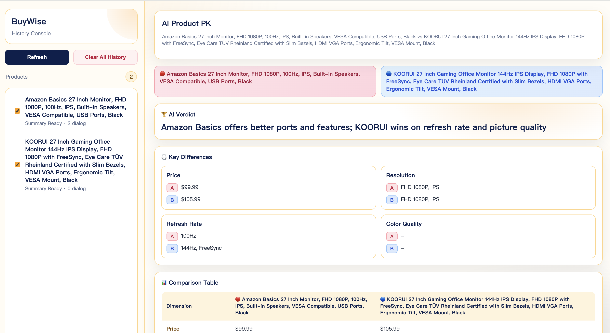
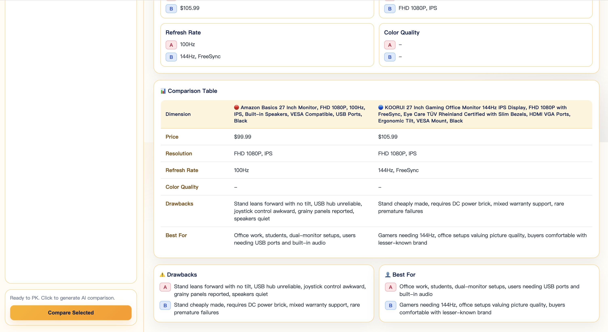

# BuyWise



BuyWise is a Chrome extension + FastAPI app powered by ASI1 for product intelligence on Amazon pages.

### 3-Minute Demo Video

[Watch on YouTube](https://youtu.be/NYBPWtpeLhM)

Core capabilities:

- Floating in-page widget injection
- AI product summary (pros / cons / verdict)
- Review-grounded Q&A
- Local history persistence via `chrome.storage.local`
- Full-screen dashboard with Product PK comparison

---

## 1) Project Structure

```text
BuyWise/
├── frontend/
│   ├── manifest.json
│   ├── background.js
│   ├── content.js
│   ├── popup.html
│   ├── popup.js
│   ├── dashboard.html
│   ├── dashboard.css
│   └── dashboard.js
└── backend/
    ├── main.py
    ├── requirements.txt
    └── .env
```

---

## 2) Feature Overview

### In-Page Widget (`content.js`)

- Toggle widget by clicking the extension icon
- Actions:
  - `Summarize Current Product`
  - `Chat with Reviews`
  - `Open Dashboard`
- Extracts from Amazon product pages:
  - product title
  - price
  - review texts

### Popup (`popup.js`)

- Supports the same summary/chat workflow
- Also writes history to local storage for dashboard usage

### Dashboard (`dashboard.html`)

- Left sidebar:
  - product history list (from `chrome.storage.local`)
  - checkboxes for selection
  - `Compare Selected` (enabled only when exactly 2 are selected)
  - `Clear All History`
- Right panel:
  - welcome + stats
  - single product detail (summary + chat history)
  - Product PK result (cards + table)

### Product PK

- Combines two selected products' local data
- Calls backend `/chat`
- Renders structured output:
  - AI Verdict
  - Key Differences
  - Drawbacks
  - Best For

---

## 3) Product Views (Screenshots)

### Widget View



### Dashboard - Product PK





---

## 4) Tech Stack

- **Extension Frontend**: Manifest V3, Vanilla JavaScript, CSS
- **Backend**: FastAPI, Uvicorn
- **LLM**: ASI1 `asi1`

---

## 5) Setup

### 5.1 Backend

```bash
cd backend
pip install -r requirements.txt
```

Dependencies:

- `fastapi`
- `uvicorn[standard]`
- `requests`
- `python-dotenv`
- `python-multipart`

Environment:

- `ASI1_API_KEY`
- `ASI1_BASE_URL` (optional, default: `https://api.asi1.ai/v1`)
- `ASI1_MODEL` (optional, default: `asi1`)

Run:

```bash
uvicorn main:app --reload
```

Backend URL: `http://localhost:8000`

### 5.2 Chrome Extension

1. Open `chrome://extensions/`
2. Enable **Developer mode**
3. Click **Load unpacked**
4. Select the `frontend/` folder

---

## 6) How to Use

1. Start backend (`uvicorn main:app --reload`)
2. Open an Amazon product page
3. Click the extension icon to open the widget
4. Click `Summarize Current Product`
5. Ask follow-up questions in `Chat with Reviews`
6. Click `Open Dashboard`
7. In dashboard:
   - browse history
   - select 2 products
   - click `Compare Selected`

---

## 7) Backend API

Defined in `backend/main.py`.

### `POST /api/analyze`

Request:

```json
{
  "title": "string",
  "price": "string",
  "reviews": "string"
}
```

Response:

```json
{
  "result": "string"
}
```

### `POST /chat`

Request:

```json
{
  "question": "string",
  "context_reviews": ["string"]
}
```

Response:

```json
{
  "answer": "string"
}
```

---

## 8) Local Storage Schema

Storage: `chrome.storage.local`  
Key: product name  
Value example:

```json
{
  "Monster Energy Zero Ultra": {
    "productName": "Monster Energy Zero Ultra",
    "price": "$18.99",
    "reviews": ["review1", "review2"],
    "summary": "AI summary text",
    "chatHistory": [
      { "role": "user", "text": "Question...", "timestamp": 1730000000000 },
      { "role": "assistant", "text": "Answer...", "timestamp": 1730000000100 }
    ],
    "updatedAt": 1730000000200
  }
}
```

---

## 9) Manifest Permissions

From `frontend/manifest.json`:

- `activeTab`
- `scripting`
- `storage`

Host permissions include:

- `http://localhost:8000/*`
- Amazon domains (`.com`, `.ca`, `.co.uk`, `.de`, `.fr`, `.it`, `.es`, `.co.jp`, `.com.au`, `.in`)

---

## 10) Troubleshooting

### Dashboard shows no records

Run summary/chat at least once from widget or popup.  
Dashboard only reads from `chrome.storage.local`.

### UI code changed but page looks old

Reload extension in `chrome://extensions/`, then refresh the target tab / reopen dashboard.

### ASI1 request fails

Check:

- `ASI1_API_KEY` is set correctly in `backend/.env`
- `ASI1_BASE_URL` is reachable
- API key has permission to call model `asi1`

---

## 11) Hackathon Demo Flow

1. Product A: summarize + ask one question
2. Product B: summarize + ask one question
3. Open dashboard and show history/stats
4. Select A + B and run Product PK
5. Show comparison cards and table

---

## 12) License

For demo and internal use.
